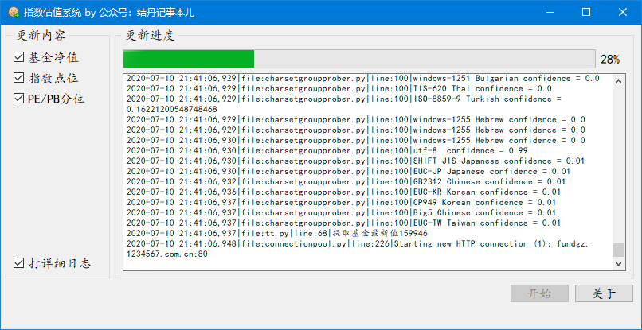

# 指数估值系统

这是一个完整的指数和估值信息提取工具，覆盖了常见的沪深指数，通过观察指数点位和估值高低，达到建仓和减仓的目的。能够节省大量的投资决策时间，本人已使用超过半年，体验非常好。

## 原理
从网络上抓取指数和估值信息，写入Excel文件。

>Excel文件暂不公开，需要请捐助后联系公众号。

## 使用方法
1. 运行工具
1. 打开Excel文件
1. 查看指数和估值点位决策是否调仓
1. 更多使用经验可以加公众号入群后交流。

## 关于

**源代码遵循LGPL协议，传播请保留本仓库地址和原作者。**

如果你对这个工具感兴趣，可以捐助后留言，会受到所有源码和答疑。

我的公众号会有一些其他投资工具和方法的经验分享，欢迎关注，也可以进群抱团买基金。

